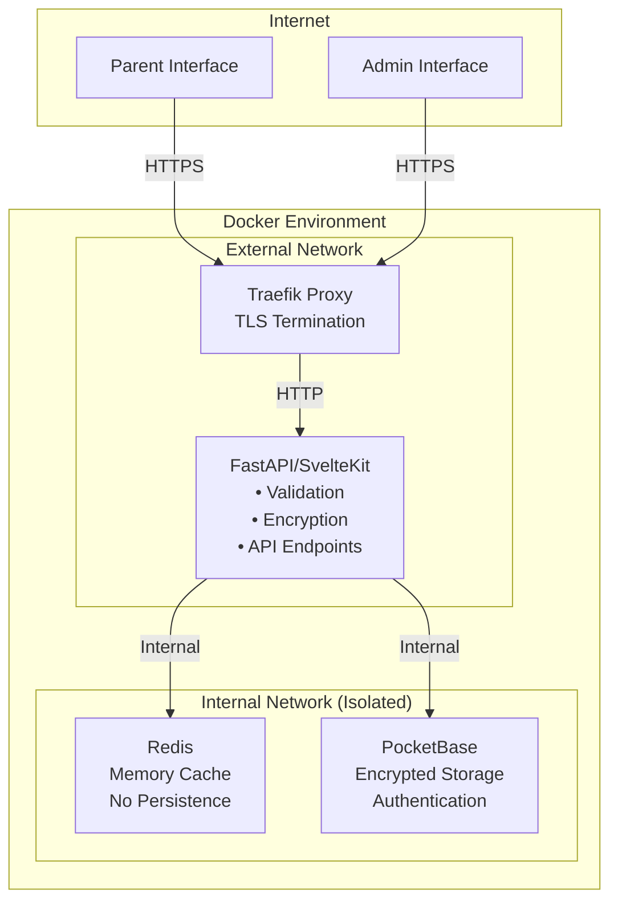
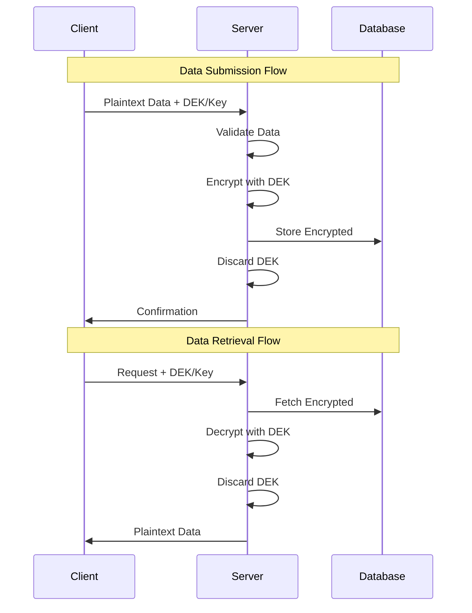
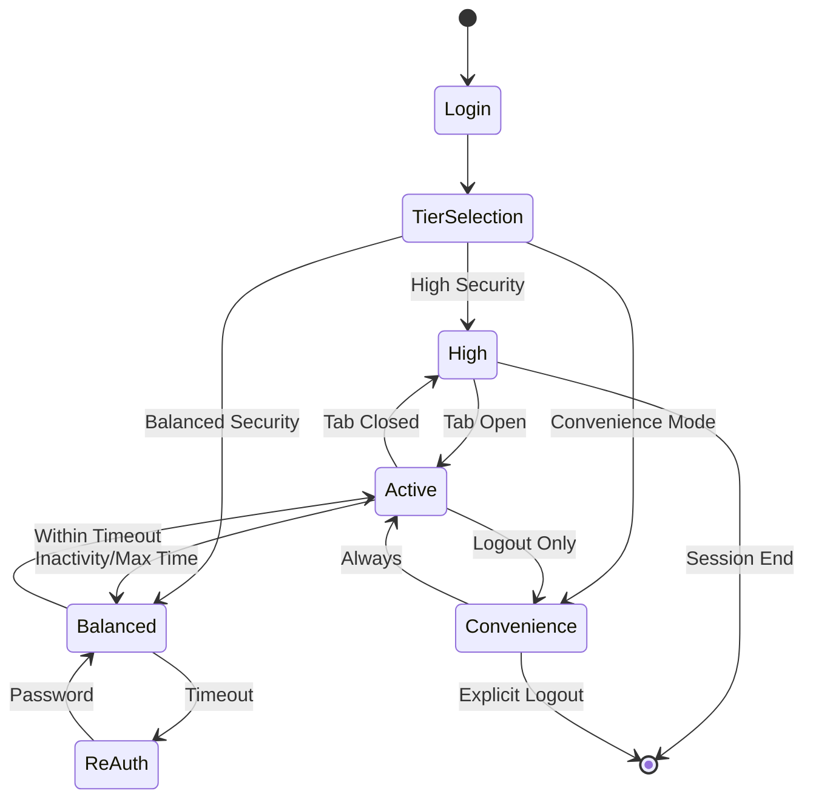

# KigaPrio System Architecture
## Security & Encryption Documentation

### Table of Contents
1. [System Overview](#system-overview)
2. [Core Security Principles](#core-security-principles)
3. [Three-Tier Security Model](#three-tier-security-model)
4. [Encryption Implementation](#encryption-implementation)
5. [Authentication & Session Management](#authentication--session-management)
6. [Data Storage Specifications](#data-storage-specifications)
7. [GDPR Compliance](#gdpr-compliance)
8. [Security Guarantees](#security-guarantees)

---

## System Overview

KigaPrio implements a privacy-first architecture for managing sensitive data with server-side encryption and user-controlled security levels.

### Technology Stack

- **Backend**: FastAPI with SvelteKit server
- **Database**: PocketBase (SQLite-based with built-in auth)
- **Cache**: Redis (memory-only, no persistence)
- **Proxy**: Traefik (reverse proxy with TLS termination)
- **Deployment**: Docker with network isolation

### Network Architecture



---

## Core Security Principles

### 1. Server-Side Encryption
All encryption and decryption operations occur server-side to ensure:
- **Data validation** before encryption
- **Business logic enforcement**
- **Prevention of database poisoning**
- **Consistent security implementation**

### 2. No Persistent Storage of Plaintext
- Server never persistently stores plaintext data
- Admin private key never exists on server
- User passwords immediately discarded after key derivation

### 3. Network Isolation
- Database tier has no internet access
- Internal services communicate only within Docker network
- External access only through authenticated API endpoints

### 4. Data Minimization
- Only essential data collected (GDPR Article 5)
- Encryption keys user-specific
- No tracking or analytics

### 5. Role-based access control
- Data access restricted on database level by API rules
- Additionally restricted on backend level by role based access

---

## Three-Tier Security Model

Users select their preferred security level at login, balancing security with convenience:

### High Security Mode
**Target Use Case**: Shared devices, elevated privacy requirements

| Aspect                | Implementation |
|-----------------------|---------------|
| **DEK Storage**       | Client sessionStorage only |
| **Session Duration**  | Browser tab lifetime |
| **Re-authentication** | Required for each new tab |
| **Server Exposure**   | Zero (transient processing only) |
| **XSS Vulnerability** | Medium (DEK in sessionStorage) |

### Balanced Security Mode (Default)
**Target Use Case**: Personal devices, regular usage

| Aspect                | Implementation |
|-----------------------|---------------|
| **DEK Storage**       | Split-key system (server cache + client) |
| **Session Duration**  | 30-minute inactivity timeout, 8-hour maximum |
| **Re-authentication** | After timeout or maximum duration |
| **Server Exposure**   | Encrypted DEK fragment only |
| **XSS Vulnerability** | Low (requires both key parts) |

### Convenience Mode
**Target Use Case**: Trusted personal devices, low-sensitivity scenarios

| Aspect                | Implementation |
|-----------------------|---------------|
| **DEK Storage**       | Client localStorage (persistent) |
| **Session Duration**  | Until explicit logout |
| **Re-authentication** | Only on logout/password change |
| **Server Exposure**   | Zero (transient processing only) |
| **XSS Vulnerability** | High (full DEK in localStorage) |

---

## Encryption Implementation

### Key Management

**DEK (Data Encryption Key)**
- 256-bit AES key generated per user
- Unique for each user account
- Never stored in plaintext on server

**Key Wrapping**
- **User Access**: DEK wrapped with PBKDF2-derived key from password
- **Admin Access**: DEK wrapped with admin RSA public key
- **Password Changes**: Only rewrap required, no data re-encryption

### Encryption Flow



### Split-Key Implementation (Balanced Mode)

The split-key system divides the DEK into two components:

1. **Server Component**: Encrypted and cached in Redis
2. **Client Component**: Stored in sessionStorage


## Authentication & Session Management

### Authentication Layers

1. **Primary Authentication**: PocketBase session (30-day validity)
2. **Encryption Access**: Tier-dependent DEK management
3. **Session Extension**: Activity-based for Balanced mode

### Session Lifecycle



### Password Change Protocol

1. Verify current password
2. Retrieve wrapped DEKs
3. Unwrap with old password
4. Rewrap with new password
5. Update database records
6. Invalidate all existing sessions
7. Force re-authentication globally

---

## Data Storage Specifications

### Database Schema (PocketBase)

```sql
-- Users Table
CREATE TABLE users (
    id TEXT PRIMARY KEY,
    username TEXT UNIQUE NOT NULL,
    password TEXT NOT NULL,  -- bcrypt hash
    salt TEXT NOT NULL,  -- PBKDF2 salt
    user_wrapped_dek TEXT NOT NULL,  -- Base64
    admin_wrapped_dek TEXT NOT NULL,  -- Base64
    security_tier TEXT CHECK (tier IN ('high', 'balanced', 'convenience')),
    created_at TIMESTAMP,
    updated_at TIMESTAMP
);

-- Encrypted Data Table
CREATE TABLE priorities (
    id TEXT PRIMARY KEY,
    user_id TEXT REFERENCES users(id),
    encrypted_data TEXT NOT NULL,  -- AES-256-GCM encrypted
    iv TEXT NOT NULL,  -- Initialization vector
    created_at TIMESTAMP,
    updated_at TIMESTAMP
);
```

### Cache Structure (Redis)

**Balanced Mode Only**
```json
{
  "key": "dek:{user_id}:{session_token}",
  "value": {
    "encrypted_server_part": "base64_string",
    "created_at": "2024-01-01T00:00:00Z",
    "last_accessed": "2024-01-01T00:30:00Z"
  },
  "ttl": 1800
}
```

**Redis Configuration**
```bash
redis-server --save "" --appendonly no --maxmemory 256mb --maxmemory-policy allkeys-lru
```

### Client Storage

| Security Tier | Storage Type      | Key               | Persistence |
|---------------|-------------------|-------------------|-------------|
| High          | sessionStorage    | `dek`             | Tab session only |
| Balanced      | sessionStorage    | `client_key_part` | Tab session only |
| Convenience   | localStorage      | `dek`             | Until logout |
| All           | Cookie (HttpOnly) | `pb_auth`         | 30 days |

---

## GDPR Compliance

### Data Protection Principles

1. **Lawfulness**: Explicit consent required (Article 6)
2. **Purpose Limitation**: Data used only for childcare prioritization (Article 5)
3. **Data Minimization**: Only essential information collected (Article 5)
4. **Accuracy**: User-controlled data updates (Article 5)
5. **Storage Limitation**: User-initiated deletion available, data deleted after month has passed (Article 5)
6. **Security**: End-to-end encryption implementation (Article 32)

### User Rights Implementation

| Right                       | Implementation |
|-----------------------------|---------------|
| **Access** (Art. 15)        | Authenticated data export |
| **Rectification** (Art. 16) | Direct edit interface |
| **Erasure** (Art. 17)       | Account deletion with cascade |
| **Portability** (Art. 20)   | JSON/CSV export formats |
| **Object** (Art. 21)        | Account deactivation option |

### Technical Measures (Article 32)

- **Encryption**: AES-256-GCM for data at rest
- **Pseudonymization**: User IDs separate from personal data
- **Access Control**: Role-based permissions
- **Audit Logging**: Security-relevant events tracked
- **Regular Testing**: Automated security testing pipeline

### Data Breach Protocol

1. Detection within 24 hours (monitoring)
2. Assessment of impact
3. User notification if high risk (within 72 hours)
4. Authority notification (within 72 hours)
5. Documentation of breach and response

---

## Security Guarantees

### All Security Tiers

✅ **Server-side encryption** - Data encrypted at rest  
✅ **Server validation** - Prevents malicious data injection  
✅ **Network isolation** - Database unreachable from internet  
✅ **No plaintext storage** - Server never stores plaintext  
✅ **User control** - Choice of security level  
✅ **Admin separation** - Private key on local machine only  
✅ **Efficient updates** - Password change without re-encryption  

### Attack Resistance Matrix

| Attack Vector          | High         | Balanced      | Convenience   | Mitigation |
|------------------------|--------------|---------------|---------------|------------|
| Database breach        | ✅ Protected | ✅ Protected  | ✅ Protected  | AES-256 encryption |
| Server compromise      | ✅ No DEK    | ⚠️ Partial DEK | ✅ No DEK     | Split-key/transient |
| Network eavesdropping  | ✅ TLS       | ✅ TLS        | ✅ TLS        | HTTPS enforced |
| XSS attack             | ⚠️ Session    | ✅ Split-key  | ❌ Full DEK   | CSP headers |
| Device theft           | ✅ Session   | ✅ Session    | ❌ Persistent | Storage choice |
| CSRF attack            | ✅ Protected | ✅ Protected  | ✅ Protected  | Token validation |
| Session hijacking      | ✅ Limited   | ✅ Limited    | ⚠️ Extended    | Timeout/rotation |
| Role escalation        | ✅ Protected | ✅ Protected  | ✅ Protected  | Disallowed on backend and database |

### Security Headers

```nginx
# Enforced via Traefik
Strict-Transport-Security: max-age=31536000; includeSubDomains
Content-Security-Policy: default-src 'self'; script-src 'self'
X-Frame-Options: DENY
X-Content-Type-Options: nosniff
Referrer-Policy: strict-origin-when-cross-origin
```

---

## Deployment Considerations

### Monitoring & Alerting

- Failed authentication attempts
- Unusual data access patterns
- Session anomalies
- Encryption/decryption failures
- System resource utilization

---

## References

- [GDPR Official Text](https://gdpr-info.eu/)
- [OWASP Security Guidelines](https://owasp.org/)
- [NIST Cryptographic Standards](https://www.nist.gov/cryptography)
- [PocketBase Documentation](https://pocketbase.io/docs/)

---

*Last Updated: 2025*  
*Version: 1.0.0*
