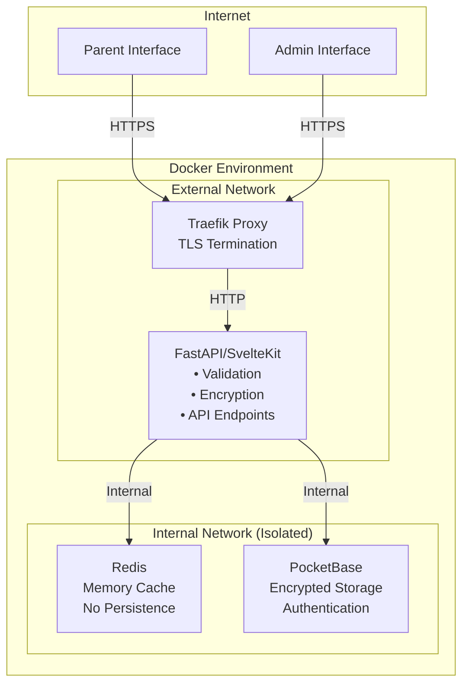
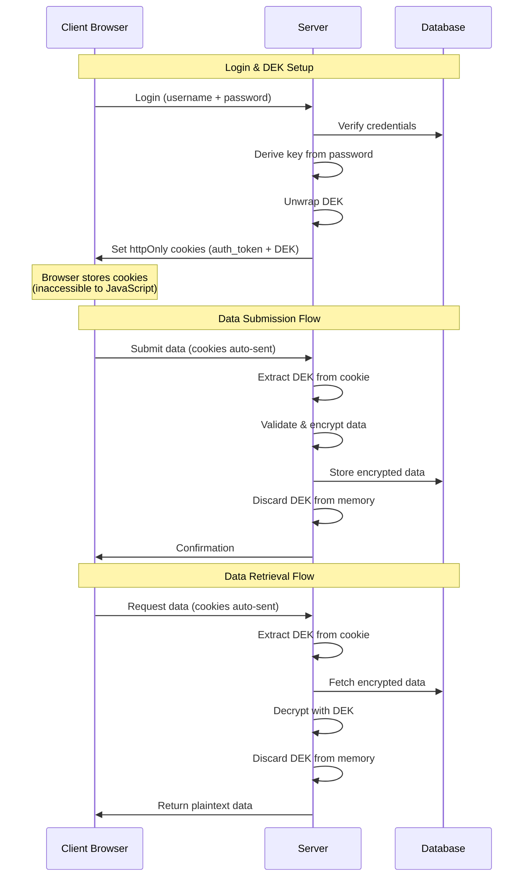
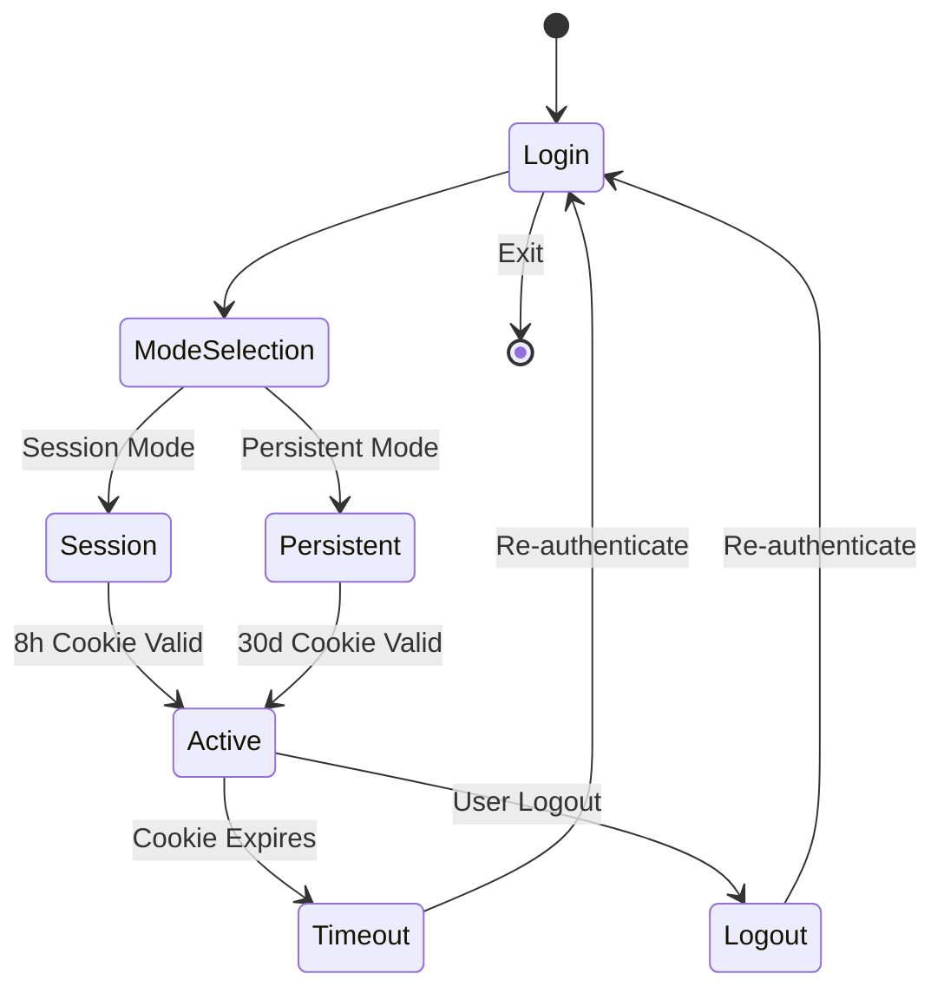

# KigaPrio System Architecture
## Security & Encryption Documentation

### Table of Contents
1. [System Overview](#system-overview)
2. [Core Security Principles](#core-security-principles)
3. [Two-Tier Security Model](#two-tier-security-model)
4. [Encryption Implementation](#encryption-implementation)
5. [Authentication & Session Management](#authentication--session-management)
6. [Data Storage Specifications](#data-storage-specifications)
7. [GDPR Compliance](#gdpr-compliance)
8. [Security Guarantees](#security-guarantees)

---

## System Overview

KigaPrio implements a privacy-first architecture for managing sensitive data with server-side encryption and httpOnly cookie-based session management.

### Technology Stack

- **Backend**: FastAPI with SvelteKit server
- **Database**: PocketBase (SQLite-based with built-in auth)
- **Cache**: Redis (memory-only, no persistence)
- **Proxy**: Traefik (reverse proxy with TLS termination)
- **Deployment**: Docker with network isolation

### Network Architecture



---

## Core Security Principles

### 1. Server-Side Encryption
All encryption and decryption operations occur server-side to ensure:
- **Data validation** before encryption
- **Business logic enforcement**
- **Prevention of database poisoning**
- **Consistent security implementation**

### 2. No Persistent Storage of Plaintext
- Server never persistently stores plaintext data
- Admin private key never exists on server
- User passwords immediately discarded after key derivation

### 3. HttpOnly Cookie Security
- DEK stored in httpOnly cookies
- No client-side JavaScript access to encryption keys
- Automatic cookie management by browser
- CSRF protection via SameSite=Strict

### 4. Network Isolation
- Database tier has no internet access
- Internal services communicate only within Docker network
- External access only through authenticated API endpoints

### 5. Data Minimization
- Only essential data collected (GDPR Article 5)
- Encryption keys user-specific
- No tracking or analytics

### 6. Role-based Access Control
- Data access restricted on database level by API rules
- Additionally restricted on backend level by role-based access

---

## Two-Tier Security Model

Users select their preferred security level at login, balancing session duration with convenience:

### Session Mode
**Target Use Case**: Shared devices, shorter sessions, moderate security

| Aspect                | Implementation |
|-----------------------|---------------|
| **DEK Storage**       | HttpOnly cookie (JavaScript-inaccessible) |
| **Cookie Duration**   | 8 hours maximum |
| **Session Duration**  | Until cookie expiration or logout |
| **Re-authentication** | After 8 hours or on logout |
| **Server Exposure**   | Transient processing only |
| **XSS Vulnerability** | None (httpOnly protection) |
| **CSRF Protection**   | SameSite=Strict |

**Security Properties:**
- ✅ Protected from XSS attacks
- ✅ Automatic browser security
- ✅ Server doesn't store DEK
- ⚠️ Shorter session requires more frequent login
- ✅ Suitable for shared devices

### Persistent Mode
**Target Use Case**: Personal devices, extended sessions, maximum convenience

| Aspect                | Implementation |
|-----------------------|---------------|
| **DEK Storage**       | HttpOnly cookie (JavaScript-inaccessible) |
| **Cookie Duration**   | 30 days maximum |
| **Session Duration**  | Until cookie expiration or logout |
| **Re-authentication** | After 30 days or on logout |
| **Server Exposure**   | Transient processing only |
| **XSS Vulnerability** | None (httpOnly protection) |
| **CSRF Protection**   | SameSite=Strict |

**Security Properties:**
- ✅ Protected from XSS attacks
- ✅ Automatic browser security
- ✅ Server doesn't store DEK
- ✅ Convenient for trusted devices
- ⚠️ Longer exposure window if device stolen

### Admin Sessions
Administrators always use a special high-security configuration:

| Aspect                | Implementation |
|-----------------------|---------------|
| **Session Duration**  | 15 minutes maximum |
| **DEK Storage**       | HttpOnly cookie |
| **Re-authentication** | Required after 15 minutes |
| **Additional Security** | Shorter timeout, frequent re-validation |

---

## Encryption Implementation

### Key Management

**DEK (Data Encryption Key)**
- 256-bit AES key generated per user
- Unique for each user account
- Never stored in plaintext on server
- Transmitted only via secure httpOnly cookies

**Key Wrapping**
- **User Access**: DEK wrapped with PBKDF2-derived key from password
- **Admin Access**: DEK wrapped with admin RSA public key
- **Password Changes**: Only rewrap required, no data re-encryption

### HttpOnly Cookie Flow



### Cookie Security Configuration

```python
# Server-side cookie configuration
response.set_cookie(
    key="dek",
    value=base64.b64encode(dek).decode("utf-8"),
    max_age=cookie_max_age,  # 8 hours or 30 days
    path="/",
    domain=COOKIE_DOMAIN,  # Production domain
    secure=True,  # HTTPS only
    httponly=True,  # No JavaScript access
    samesite="strict"  # CSRF protection
)
```

---

## Authentication & Session Management

### Authentication Layers

1. **Primary Authentication**: PocketBase session token in httpOnly cookie
2. **Encryption Access**: DEK in separate httpOnly cookie
3. **Session Validation**: Redis-cached session info for performance

### Session Lifecycle



### Cookie Management

**Automatic Browser Handling:**
- Browser automatically includes cookies in requests
- No JavaScript access to sensitive data
- Cookies cleared on logout
- Expiration handled by browser


### Password Change Protocol

1. Verify current password
2. Retrieve wrapped DEKs
3. Unwrap with old password
4. Rewrap with new password
5. Update database records
6. Invalidate all existing sessions
7. Clear all cookies
8. Force re-authentication globally

---

## Data Storage Specifications

### Database Schema (PocketBase)

```sql
-- Users Table
CREATE TABLE users (
    id TEXT PRIMARY KEY,
    username TEXT UNIQUE NOT NULL,
    password TEXT NOT NULL,  -- bcrypt hash
    salt TEXT NOT NULL,  -- PBKDF2 salt
    user_wrapped_dek TEXT NOT NULL,  -- Base64
    admin_wrapped_dek TEXT NOT NULL,  -- Base64
    role TEXT CHECK (role IN ('user', 'admin', 'service')),
    created_at TIMESTAMP,
    updated_at TIMESTAMP
);

-- Encrypted Data Table
CREATE TABLE priorities (
    id TEXT PRIMARY KEY,
    user_id TEXT REFERENCES users(id),
    month TEXT NOT NULL,
    encrypted_fields TEXT NOT NULL,  -- AES-256-GCM encrypted JSON
    created_at TIMESTAMP,
    updated_at TIMESTAMP
);
```

### Cache Structure (Redis)

**Session Information Cache**
```json
{
  "key": "session:{auth_token}",
  "value": {
    "id": "user_id",
    "username": "username",
    "is_admin": false
  },
  "ttl": 28800  // 8 hours (session) or 2592000 (30 days)
}
```

**Rate Limiting**
```json
{
  "key": "rate_limit:login:{ip}",
  "value": "attempts_count",
  "ttl": 60
}
```

### Client Storage (Cookies Only)

| Cookie Name   | Content        | HttpOnly | Secure | SameSite | Max Age         |
|---------------|----------------|----------|--------|----------|-----------------|
| `auth_token`  | Session token  | ✅       | ✅     | Strict   | 8h or 30d       |
| `dek`         | Encrypted DEK  | ✅       | ✅     | Strict   | 8h or 30d       |

---

## GDPR Compliance

### Data Protection Principles

1. **Lawfulness**: Explicit consent required (Article 6)
2. **Purpose Limitation**: Data used only for childcare prioritization (Article 5)
3. **Data Minimization**: Only essential information collected (Article 5)
4. **Accuracy**: User-controlled data updates (Article 5)
5. **Storage Limitation**: User-initiated deletion available (Article 5)
6. **Security**: Server-side encryption implementation (Article 32)

### User Rights Implementation

| Right                       | Implementation |
|-----------------------------|---------------|
| **Access** (Art. 15)        | Authenticated data export |
| **Rectification** (Art. 16) | Direct edit interface |
| **Erasure** (Art. 17)       | Account deletion with cascade |
| **Portability** (Art. 20)   | JSON/CSV export formats |
| **Object** (Art. 21)        | Account deactivation option |

### Technical Measures (Article 32)

- **Encryption**: AES-256-GCM for data at rest
- **Pseudonymization**: User IDs separate from personal data
- **Access Control**: Role-based permissions
- **Secure Transmission**: TLS 1.3 for all connections
- **HttpOnly Cookies**: XSS protection for sensitive data
- **Audit Logging**: Security-relevant events tracked
- **Regular Testing**: Automated security testing pipeline

### Data Breach Protocol

1. Detection within 24 hours (monitoring)
2. Assessment of impact
3. User notification if high risk (within 72 hours)
4. Authority notification (within 72 hours)
5. Documentation of breach and response

---

## Security Guarantees

### Both Security Modes

✅ **Server-side encryption** - Data encrypted at rest  
✅ **Server validation** - Prevents malicious data injection  
✅ **Network isolation** - Database unreachable from internet  
✅ **No plaintext storage** - Server never stores plaintext  
✅ **HttpOnly cookies** - Complete XSS protection  
✅ **CSRF protection** - SameSite=Strict cookie policy  
✅ **User control** - Choice of session duration  
✅ **Admin separation** - Private key on local machine only  
✅ **Efficient updates** - Password change without re-encryption  
✅ **Automatic cleanup** - Browser handles cookie expiration  

### Attack Resistance Matrix

| Attack Vector          | Session Mode | Persistent Mode | Mitigation |
|------------------------|--------------|-----------------|------------|
| Database breach        | ✅ Protected | ✅ Protected    | AES-256 encryption |
| Server compromise      | ✅ No DEK    | ✅ No DEK       | Transient processing only |
| Network eavesdropping  | ✅ TLS       | ✅ TLS          | HTTPS enforced |
| XSS attack             | ✅ Protected | ✅ Protected    | HttpOnly cookies + CSP |
| Device theft           | ⚠️ 8h window | ⚠️ 30d window   | Cookie expiration |
| CSRF attack            | ✅ Protected | ✅ Protected    | SameSite=Strict |
| Session hijacking      | ⚠️ Limited   | ⚠️ Extended     | Timeout/rotation |
| Cookie theft           | ⚠️ Limited   | ⚠️ Extended     | HTTPS + Secure flag |
| Role escalation        | ✅ Protected | ✅ Protected    | Backend + DB validation |
| Man-in-the-middle      | ✅ Protected | ✅ Protected    | TLS + HSTS |

**Key Security Improvements:**
- **No XSS vulnerability**: HttpOnly cookies prevent JavaScript access
- **Simplified architecture**: No split-key complexity
- **Browser-managed**: Automatic cookie handling and expiration
- **CSRF protection**: SameSite=Strict prevents cross-site attacks

### Security Headers

```nginx
# Enforced via Traefik and FastAPI middleware
Strict-Transport-Security: max-age=31536000; includeSubDomains
Content-Security-Policy: default-src 'self'; script-src 'self'
X-Frame-Options: DENY
X-Content-Type-Options: nosniff
Referrer-Policy: strict-origin-when-cross-origin
```

---

## Deployment Considerations

### Monitoring & Alerting

- Failed authentication attempts
- Unusual data access patterns
- Session anomalies
- Encryption/decryption failures
- Cookie validation failures
- System resource utilization

### Backup & Recovery

- Database encrypted at rest
- Regular automated backups
- Admin private key stored offline
- Recovery procedures documented

---

## References

- [GDPR Official Text](https://gdpr-info.eu/)
- [OWASP Security Guidelines](https://owasp.org/)
- [OWASP Cookie Security](https://owasp.org/www-community/controls/SecureCookieAttribute)
- [NIST Cryptographic Standards](https://www.nist.gov/cryptography)
- [PocketBase Documentation](https://pocketbase.io/docs/)
- [MDN HttpOnly Cookies](https://developer.mozilla.org/en-US/docs/Web/HTTP/Cookies)

---

*Last Updated: 2025*  
*Version: 2.0.0*  
