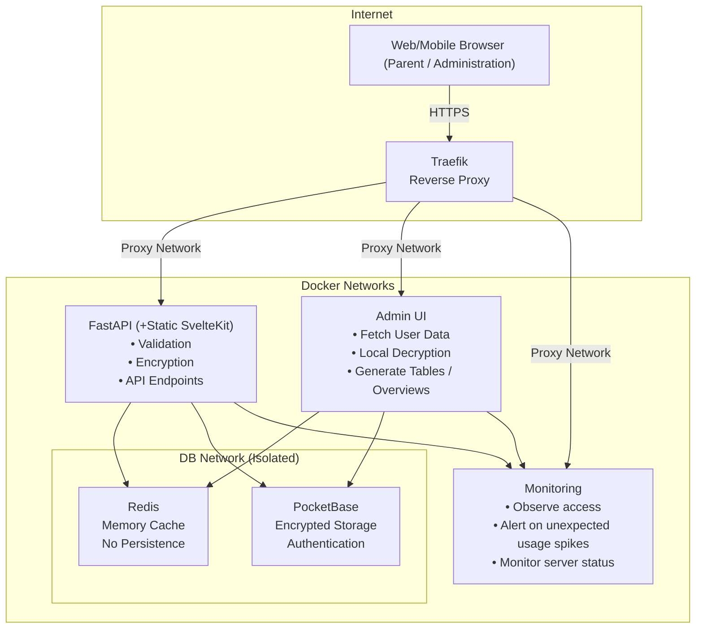
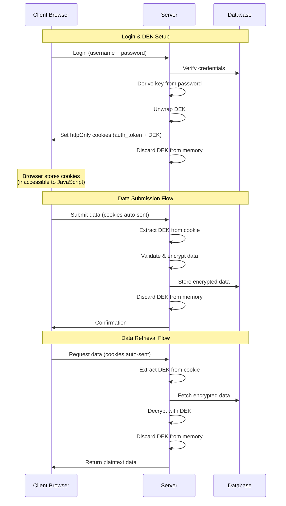

# KigaPrio System Architecture

## Table of Contents
1. [System Overview](#system-overview)
2. [Core Security Principles](#core-security-principles)
3. [Session Management](#session-management)
4. [Encryption Implementation](#encryption-implementation)
5. [Data Storage Specifications](#data-storage-specifications)
6. [GDPR Compliance](#gdpr-compliance)
7. [Security Guarantees](#security-guarantees)

---

## System Overview

KigaPrio implements a privacy-first architecture for managing sensitive data with server-side encryption. 
Goal of the architecture is to keep collected data at a pure minimum, avoid any data collection, and to minimize data losses in worst case scenarios.

### Technology Stack

- **Backend**: FastAPI
- **Frontend**: SvelteKit static webpage for client, SvelteKit Node Server for admin
- **Database**: PocketBase (SQLite-based with built-in auth)
- **Cache**: Redis
- **Proxy**: Traefik (reverse proxy with TLS termination)
- **Monitoring**: Prometheus & Alertmanager
- **Deployment**: Docker with network isolation

### Network Architecture

---

## Core Security Principles

### 1. Server-Side Encryption
All encryption and decryption operations of users occur server-side to ensure:
- **Data validation** before encryption
- Prevention of database poisoning
- After data validation, data is encrypted and discarded
- At registration data encryption key (DEK) is encrypted once using key derived from user password and once using public key of administration -> users can only decrypt their own data, and only with administrations private key all data can be decrypted

### 2. No Persistent Storage of Plaintext
- Server never persistently stores plaintext data
- Admin private key never exists on server
- User passwords immediately discarded after key derivation

### 3. HttpOnly Cookie Security
- DEK stored in httpOnly cookies
- No client-side JavaScript access to encryption keys
- To reduce XSS attack surface
- CSRF protection via SameSite=Strict

### 4. Network Isolation
- Database and cache (Pocketbase & Redis) have no internet access
- Internal services communicate only within Docker network
- External access only through authenticated API endpoints

### 5. Data Minimization
- Only essential data collected (essentially users name and priorities of the month)
- Encryption keys user-specific
- No tracking or analytics

### 6. Role-based Access Control
- Data access is restricted on database level by API rules (Pocketbase internal funtionality to set rules on data access)
- Additionally restricted on backend level by role-based access

---

## Session Management

Users can choose to stay logged in when authenticating:

### "Keep me logged in" unchecked (Default)
- Session expires after **8 hours** of inactivity
- Suitable for shared or public computers
- Requires re-authentication after expiration

### "Keep me logged in" checked
- Session expires after **30 days** of inactivity  
- Convenient for personal devices
- Requires re-authentication after expiration

### Security Implementation
Both modes use the same security approach:
- DEK stored in **HttpOnly cookies** (protected from JavaScript/XSS)
- **SameSite=Strict** protection against CSRF
- Server never stores DEK permanently
- Automatic logout on session expiration

### Admin Sessions
Administrator sessions use shorter timeouts:
- **15 minutes** maximum session duration
- Requires more frequent re-authentication
- Same HttpOnly cookie protection

**Note**: All session cookies are cleared on explicit logout, regardless of the "keep me logged in" setting.

---

## Encryption Implementation

### Key Management

**DEK (Data Encryption Key)**
- 256-bit AES key generated per user at registration
- Unique for each user account
- Never stored in plaintext on server
- Transmitted only via secure httpOnly cookies

**Key Wrapping**
- **User Access**: DEK wrapped with PBKDF2-derived key from password
- **Admin Access**: DEK wrapped with admin RSA public key
- Database stores wrapped DEK keys so only users & admin can decrypt data

### HttpOnly Cookie Flow

---

## Data Storage Specifications

### Database Schema (PocketBase)

users
| Field             | Type     | Description                                            |
| ----------------- | -------- | ------------------------------------------------------ |
| id                | text     | UID of user                                            |
| password          | password | Login password of user (Pocketbase Implementation)     |
| username          | text     | User chosen login name                                 |
| role              | select   | user, generic, service or admin                        |
| salt              | text     | Salt for user_wrapped_dek                              |
| user_wrapped_dek  | text     | DEK encrypted with key derived from user password+salt |
| admin_wrapped_dek | text     | DEK encrypted with admin public key                    |
| encrypted_fields  | text     | the real name of the user                              |
| created_at        | autodate | Time of creation of the user                           |
| updated_at        | autodate | Last update of the user                                |

priorities
| Field            | Type     |
| ---------------- | -------- |
| userId           | relation |
| identifier       | text     |
| month            | text     |
| encrypted_fields | text     |
| manual           | boolean  |
| created          | autodate |
| updated          | autodate |

---

## GDPR Compliance

### Data Protection Principles

1. **Lawfulness**: Explicit consent required (Article 6)
2. **Purpose Limitation**: Data used only for childcare prioritization (Article 5)
3. **Data Minimization**: Only essential information collected: name + priorities (Article 5)
4. **Accuracy**: User-controlled data updates (Article 5)
5. **Storage Limitation**: User-initiated deletion available, auto deletion on inactivity (Article 5)
6. **Security**: Server-side encryption implementation (Article 32)

### User Rights Implementation

| Right                       | Implementation                |
| --------------------------- | ----------------------------- |
| **Access** (Art. 15)        | Authenticated data export     |
| **Rectification** (Art. 16) | Direct edit interface         |
| **Erasure** (Art. 17)       | Account deletion with cascade |
| **Portability** (Art. 20)   | JSON/CSV export formats       |
| **Object** (Art. 21)        | Account deactivation option   |

### Technical Measures (Article 32)

- **Encryption**: AES-256-GCM for data at rest
- **Pseudonymization**: User IDs separate from personal data
- **Access Control**: Database API rules + Role-based permissions
- **Secure Transmission**: TLS 1.3 for all connections
- **HttpOnly Cookies**: XSS protection for sensitive data
- **Monitoring**: Security-relevant events tracked

### Data Breach Protocol

1. Detection of unsual behaviour via monitoring + email notification
2. Assessment of impact
3. User notification if high risk (within 72 hours via secondary application)
4. Documentation of breach and response

---

## Security Guarantees

### Threat Model & Attack Resistance

Understanding what attackers could access and the impact:

| Attack Scenario                           | What Attacker Gets                                   | Impact                                                                   | Protection                                                                            | Risk Level   |
| ----------------------------------------- | ---------------------------------------------------- | ------------------------------------------------------------------------ | ------------------------------------------------------------------------------------- | ------------ |
| **Database breach**                       | Encrypted user data + wrapped DEKs, user login names | None without admin private key or user passwords                         | AES-256-GCM encryption                                                                | ✅ Low        |
| **Server compromise (read-only)**         | DEKs in memory during active requests only           | Limited to users submitting/viewing data during breach window (~seconds) | Transient DEK lifecycle, stateless processing                                         | ⚠️ Low-Medium |
| **Server compromise (code modification)** | Future DEKs can be logged/exfiltrated                | All future user data compromised until detection                         | Code integrity monitoring, server monitoring, server access strongly restricted       | 🔴 Critical   |
| **Stolen device (logged in)**             | One user's priorities for current month              | Limited to single user, expires after 8h/30d                             | Session timeout, device-level security                                                | ⚠️ Medium     |
| **Admin private key theft**               | All encrypted user data becomes readable             | Complete data breach                                                     | Offline key storage, no server copy, second factor on private key (password or token) | 🔴 High       |
| **Network interception**                  | Nothing (TLS encrypted)                              | None                                                                     | HTTPS/TLS 1.3 mandatory                                                               | ✅ Low        |
| **XSS/JavaScript injection**              | Cannot access DEK                                    | Limited to visible UI data                                               | HttpOnly cookies, CSP headers                                                         | ✅ Low        |
| **Password compromise**                   | Single user's encrypted data                         | One user affected                                                        | Password hashing (PBKDF2), unique DEK per user                                        | ⚠️ Medium     |
| **Phishing attack**                       | User credentials + active session                    | One user affected                                                        | User education, 2FA consideration                                                     | ⚠️ Medium     |
| **SQL injection**                         | Database access blocked                              | None                                                                     | Parameterized queries, PocketBase ORM                                                 | ✅ Low        |
| **Registration token leak**               | Unauthorized account creation                        | System spam, requires cleanup                                            | Token rotation, rate limiting                                                         | ⚠️ Medium     |

### Key Insight: Isolation Boundaries

The system has three primary isolation boundaries:

1. **Per-User Encryption**: Compromise of one user doesn't affect others (unique DEKs)
2. **Admin Key Separation**: No server-side storage means server compromise ≠ data breach
3. **Session Isolation**: Stolen cookie only affects one user for limited time

### What We Explicitly Don't Protect Against

- **Malicious admin with private key**: Admin can decrypt all data (by design)
- **Compromised user password / stolen cookie**: Full user access
- **Physical access to logged-in device**: Session remains valid until timeout
- **Social engineering**: Cannot prevent users from sharing credentials
- **Legal/government demands**: Encrypted data can be provided to authorities (decryption by design can only be provided by users or administration)

### Monitoring & Detection

Active monitoring for:
- Multiple failed login attempts (potential brute force)
- Unusual access patterns (e.g., 100+ priority submissions in 1 minute)
- Cookie validation failures (potential session hijacking)
- Encryption/decryption errors (potential key compromise)
- Geographic anomalies (if IP logging enabled)
- Server restarts 
---

## References

- [GDPR Official Text](https://gdpr-info.eu/)
- [OWASP Security Guidelines](https://owasp.org/)
- [OWASP Cookie Security](https://owasp.org/www-community/controls/SecureCookieAttribute)
- [NIST Cryptographic Standards](https://www.nist.gov/cryptography)
- [PocketBase Documentation](https://pocketbase.io/docs/)
- [MDN HttpOnly Cookies](https://developer.mozilla.org/en-US/docs/Web/HTTP/Cookies)

---

*Last Updated: 2025*  
*Version: 2.0.0*  
